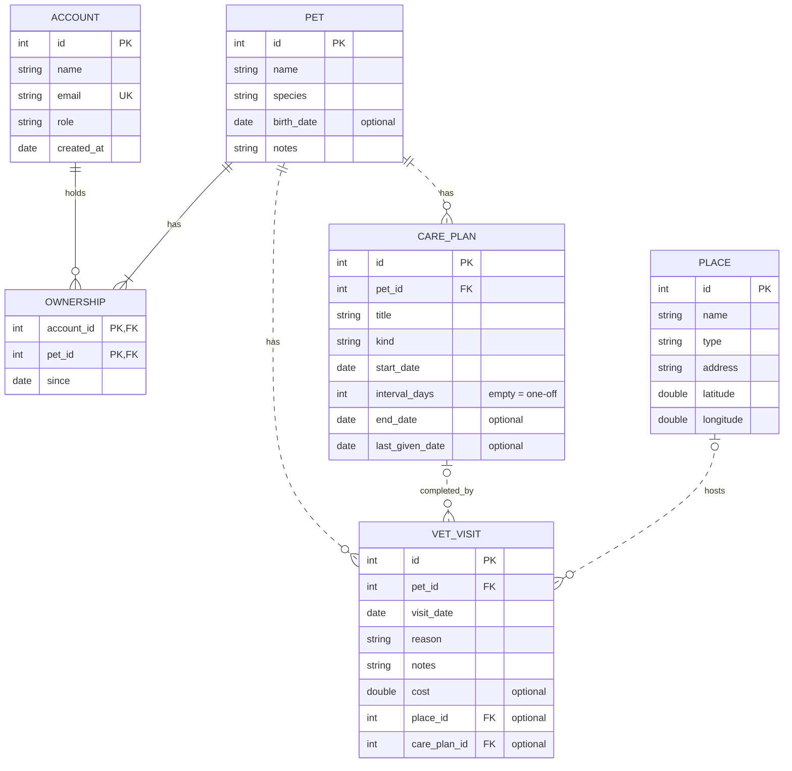

# ER diagram

Initial ER diagram for the first databases checkpoint (draft, 2026-11-12).

```mermaid
erDiagram
    ACCOUNT ||--o{ OWNERSHIP : holds
    PET ||--|{ OWNERSHIP : has
    PET ||..o{ CARE_PLAN : has
    PET ||..o{ VET_VISIT : has
    CARE_PLAN |o..o{ VET_VISIT : completed_by
    PLACE |o..o{ VET_VISIT : hosts

    ACCOUNT {
        int id PK
        string name
        string email UK
        string role
        date created_at

    }

    PET {
        int id PK
        string name
        string species
        date birth_date "optional"
        string notes
    }

    OWNERSHIP {
        int account_id PK, FK
        int pet_id PK, FK
        date since
    }

    CARE_PLAN {
        int id PK
        int pet_id FK
        string title
        string kind
        date start_date
        int interval_days "empty = one-off"
        date end_date "optional"
        date last_given_date "optional"
    }

    VET_VISIT {
        int id PK
        int pet_id FK
        date visit_date
        string reason
        string notes
        double cost "optional"
        int place_id FK "optional"
        int care_plan_id FK "optional"
    }

    PLACE {
        int id PK
        string name
        string type
        string address
        double latitude
        double longitude
    }
```